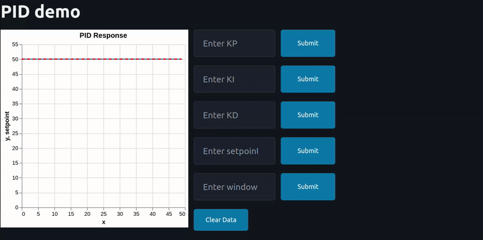

# PID-Tuner

This is a web-based UI aimed for students or people getting into control theory. The UI allows the user to experiment with the process of tunning a PID controller. The control task was taken from this [Medium](https://medium.com/@aleksej.gudkov/python-pid-controller-example-a-complete-guide-5f35589eec86) article. The problem refers to a temperature control task where the PID controller aims to maintain a setpoint temperature. 

## Demo

## Setup

to install 

    $ git pull https://github.com/BouzoulasDimitrios/PID-Tuner

    $ pip install -r requirements.txt

    $ python app.py

